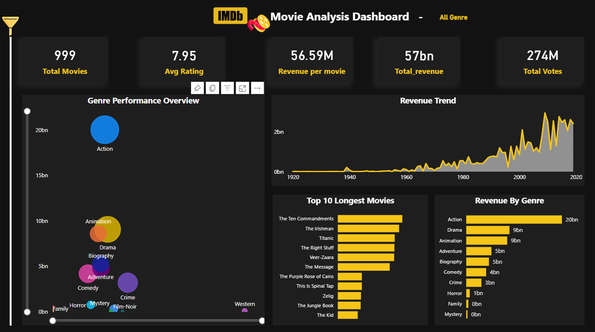

# 🎬 IMDb Movie Analysis Dashboard (Power BI)

## 📌 Overview
This project is an interactive Power BI dashboard built using the IMDb Top 1000 dataset sourced from Kaggle.  
It provides insights into movie performance, ratings, revenue trends, and genre distribution.

---

## 📊 Dashboard Preview

---

## 🎯 Objectives
- Analyze movie performance across years  
- Identify top-performing genres  
- Understand rating and revenue patterns  
- Build interactive visualizations  

---

## 🛠️ Tools & Technologies
- Power BI  
- DAX  
- Power Query  
- Data Modeling  

---

## 📁 Project Structure
---
## 📈 Key Features
- KPI cards (Movies, Ratings, Revenue, Votes)  
- Year-based trend analysis  
- Genre-wise insights  
- Interactive filters and slicers  

---

## 📂 Dataset
- Source: Kaggle (IMDb Top 1000 Dataset)

---

## 🚀 How to Use
1. Download the `.pbix` file from the `pbix/` folder  
2. Open it using Power BI Desktop  
3. Interact with filters and visuals  

---

## 💡 Learnings
- Data cleaning using Power Query  
- Writing DAX measures  
- Designing interactive dashboards  
- Improving data storytelling  

---
